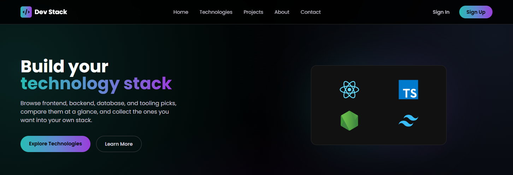
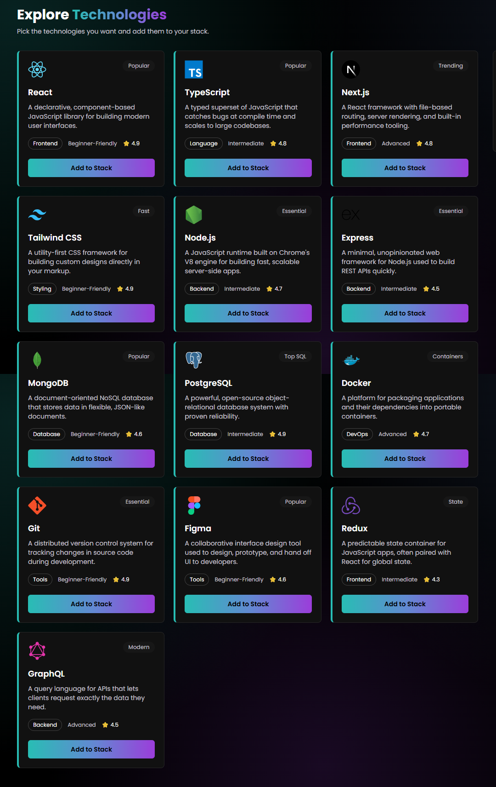
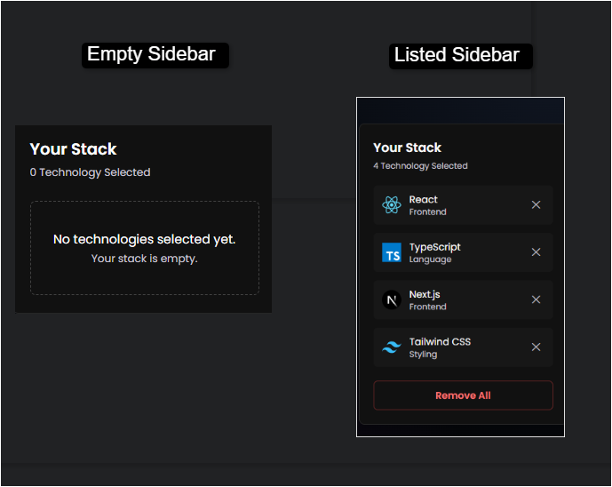

# 🚀 Dev Stack

**Build your dream tech stack, one card at a time.**

A sleek React + TypeScript app to explore frontend, backend, database, and
tooling technologies — and curate your own personal stack for your next project.

🔗 [**Live Demo**](https://dev-stack-smoky-beta.vercel.app/) &nbsp;•&nbsp; 📦 [**Repository**](https://github.com/Avijit-Datta/dev-stack)

---

## 📖 About the Project

**Dev Stack** lets you browse a catalog of technologies — each shown as a
card with its logo, category, difficulty level, star rating, and a short
description. Click **Add to Stack** to save it into a sidebar panel, where
you can review your picks, remove items one at a time, or clear everything
with **Remove All**.

The entire UI is themed around a single shared **teal → blue → violet
gradient** (`#28BDB4 → #6388D2 → #9B3DDA`), defined once and reused across
the brand name, hero heading, and primary buttons — keeping the design
consistent and easy to maintain.

---

## 🖼️ Screenshots

| Home Page | Tech Catalog | Your Stack Sidebar |
|:---:|:---:|:---:|
|  |  |  |

---

## 🛠️ Technology Used

- ⚛️ **React 18** with **TypeScript** — UI and type safety
- ⚡ **Vite** — build tool and dev server
- 🎨 **Tailwind CSS** — styling
- 🔔 **React-Toastify** — add / remove / duplicate notifications

---

## ✨ Features

1. **📦 Live tech catalog loaded from JSON**
   Technology data lives in a JSON file and is loaded on app start — not
   hardcoded inside any component — with a real loading state while it "fetches."

2. **🧩 Personal stack builder**
   Add technologies to a sidebar, block duplicate adds with a warning toast,
   remove single items, or clear the whole stack at once. Cards in the grid
   get a highlighted border while they're in your stack.

3. **📱 Fully responsive, single-source theme**
   A mobile hamburger navbar, a 1 / 2 / 3-column card grid depending on
   screen size, and one shared gradient value that themes the brand name,
   hero heading, and buttons.

---

## 🔗 Links

- **GitHub Repository:** [github.com/Avijit-Datta/dev-stack](https://github.com/Avijit-Datta/dev-stack)
- **Live Site:** [dev-stack-smoky-beta.vercel.app](https://dev-stack-smoky-beta.vercel.app/)

---

## 🧠 React Concepts — Q&A

**1. What is JSX, and why is it used in React?**
JSX is a syntax that lets you write UI that looks like HTML inside JavaScript. React uses it because it makes components easier to read and build, and it gets compiled into normal JavaScript.

**2. What is the difference between props and state?**
Props are inputs a component receives from its parent (you don't change them inside the child). State is data a component owns and can update, and when it changes React re-renders the UI.

**3. What does the `useState` hook do, and where did you use it in this project?**
`useState` lets a component "remember" a value and update it over time. In this project I used it to store the data loaded from the JSON file and to keep track of the user's selected stack/cart items.

**4. What does the `useEffect` hook do, and why did you need it to load the JSON data?**
`useEffect` is for running side tasks like fetching/loading data after a component renders. I used it to load the JSON when the component first mounts, so the data loads once instead of running on every render.

**5. Why does every item in a `.map()` list need a unique `key` prop?**
Keys help React know which item is which in a list, so it can update the right elements when something changes. Without unique keys, you can get incorrect updates and worse performance.

**6. What is conditional rendering? Show one place you used it (example: the empty stack message).**
Conditional rendering means showing different UI depending on a condition. For example, if the stack/cart is empty, you show an "empty" message, otherwise you show the list of selected items.

**7. How do you pass data from a parent component to a child component, and how does a child send something back to the parent?**
You pass data from parent to child using props. To send something back, the parent passes a callback function as a prop, and the child calls it (for example, when a button is clicked) to notify the parent or send data.

---

Made with ❤️ using React + TypeScript

